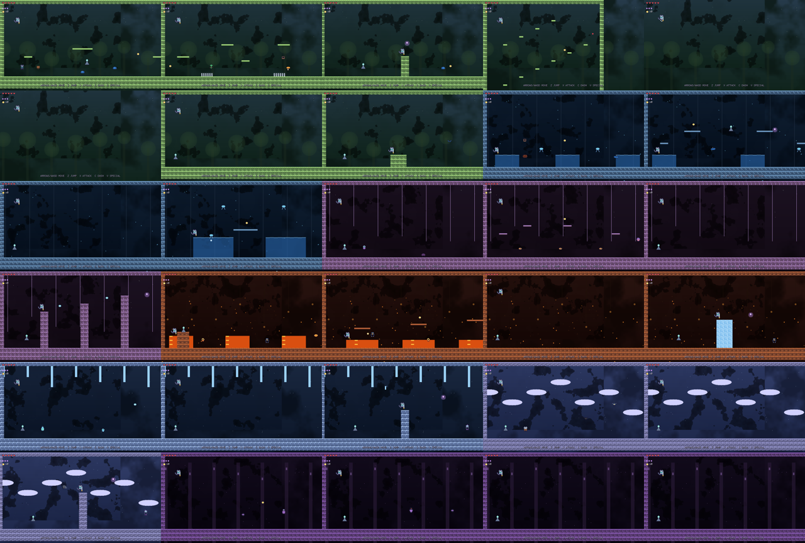
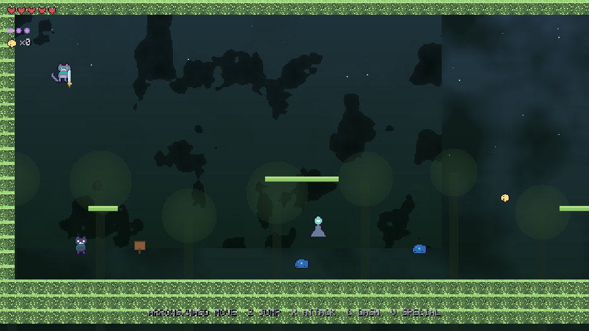

# METRODIVINIA

A hand-rolled **2D metroidvania about a cat with a sword**, built as a dependency-free
native **Windows executable** (plus a headless Linux test harness).

Everything is generated in code: the pixel art, the tile textures, the parallax
backgrounds, and the chiptune music / sound effects. There are **no external assets**.

> The playable deliverable is a **Windows `.exe`** — `dist/Metrodivinia.exe`.





## The world

Seven inter-connected zones, ~30 rooms, eight bosses, and a branching ability-gated
progression in the classic metroidvania style:

| Zone | Boss | Ability gained |
|------|------|----------------|
| Verdant Hollow | Thornmaw | Claw Dash |
| Sunken Cistern | Mire Leviathan | Nine-Lives Leap (double jump) |
| Chittering Warrens | Hive Mother Krrk | Wallclaws (wall jump) |
| Emberfoundry | Ignis, the Furnace Cat | Sunfire Fang (burn vines / melt ice) |
| Frostspire | Choir of Frost | Featherfall (glide) |
| Cloudreach Aviary | Stormcrow Archon | Stormstep (air dash) |
| Metrodivinia Core | The Metrodivinia (+ secret Ninth Life) | Divinity |

Also: shrines (save / fast-travel), NPCs & a shop, charms to equip, heart/yarn shards,
lore tablets, a fog-of-war world map, particles / screenshake / hit-stop, and a
procedural chiptune soundtrack with a track per zone.

## Controls

| Action | Keys |
|--------|------|
| Move | Arrows / WASD |
| Jump / glide | Z / K / Space |
| Attack (combo, up, down-pogo) | X / J |
| Dash | C / L / Shift |
| Special (yarn blast) | V |
| Map | M / Tab |
| Pause | Esc / P |
| Confirm / talk / open | Enter / Z |
| Cancel / back | X / Esc |

## How to run

### Play the game (Windows) — no install, no dependencies
1. Grab `dist/Metrodivinia.exe` (already built and committed in this repo).
2. Copy it anywhere on a Windows PC (any folder works).
3. Double-click `Metrodivinia.exe`. That's it — it launches straight into the title screen.
4. Press **Enter** to start a new game (or continue if a save exists).
5. Your save file (`metrodivinia.sav`) is created in the same folder as the `.exe`.

Troubleshooting: if Windows SmartScreen warns about an unknown publisher, choose
*"More info" → "Run anyway"*. The game is a single self-contained executable.

### Run the test harness (Linux, headless)
`./harness` renders screenshots and runs automated playtests (see below).

### Build from source
See [Building](#building). Windows build needs only Zig (no SDK); Linux build needs `gcc`.

## Building

The engine is plain C with a software renderer. Two targets:

* **Windows (the game):** cross-compiled with Zig's bundled C toolchain —
  `zig cc -target x86_64-windows-gnu`. No Windows SDK or external libs needed.
* **Linux (headless test harness):** `gcc`, used to render screenshots, run an
  autopilot smoke test, and exercise every boss.

```
./tools/build.sh windows   # -> dist/Metrodivinia.exe
./tools/build.sh linux     # -> ./harness (test driver)
```

Art is authored/validated and emitted to `src/art_data.h` with:

```
python3 tools/artgen.py    # regenerates sprite tables + a contact sheet
```

### Harness commands (dev / CI)

```
./harness rooms     # render every room to shots/room_XX.bmp
./harness smoke     # 40s autopilot playthrough (movement, transitions, combat)
./harness boss K    # run boss K (0..7) for a few seconds
./harness shot N    # screenshot room N
```

## Source layout

| File | Purpose |
|------|---------|
| `src/game.h` | shared types & API |
| `src/core.c` | math / rng / software renderer / font / noise |
| `src/art.c` | sprite loading, tile textures, parallax |
| `src/art_data.h` | generated pixel-art tables |
| `src/world.c` / `rooms.c` | tilemap, collision, level data |
| `src/player.c` | movement / combat / abilities |
| `src/entities.c` | enemies, NPCs, pickups |
| `src/bosses.c` | the eight boss fights |
| `src/audio.c` | procedural synth + music sequencer |
| `src/ui.c` | HUD, menus, map, dialogue, shop, credits |
| `src/platform_win32.c` | Windows window / GDI / waveOut / save IO |
| `src/harness.c` | headless Linux test driver |

Built for Arena on branch `arena/01a0a7f9-arena`.
